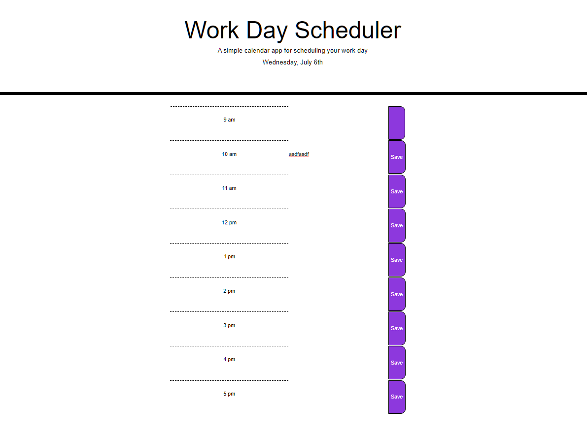

# JavaScript Workday Scheduler

## Description
This scheduler works to help people keep track of their busy workday.

## How to use the project
Users enter their scheduled appointments for the day into the text-entry boxes. They click the corresponding save button to save the appointment. 

## License
This application is totally free for anyone to use. 

## Demo of the site

Note: code assigning 'past' 'present' and 'future' tags is not functional. This site still needs plenty of work to meet the criteria, but I am stuck and running out of time. Will revisit.